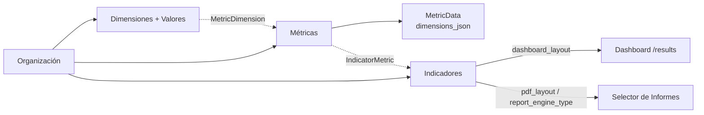

# Mapa de la aplicación

Guía rápida (5 minutos) para un desarrollador nuevo. No es exhaustiva: para detalle profundo ver `arquitectura.md` en esta misma carpeta.

## 1. Páginas (frontend/src/App.jsx + frontend/src/pages/)

| Ruta | Página | Para qué sirve | Endpoints principales | Rol |
|---|---|---|---|---|
| `/login` | `Login.jsx` | Inicio de sesión | `POST /api/auth/login`, `GET /api/auth/me` | público |
| `/` | `Home.jsx` | Landing de bienvenida, sin datos ni fetch | — | — |
| `/execution` | `Execution.jsx` | Correr pipelines existentes (solo ejecución, sin editar) | `GET /api/pipelines`, `POST /api/pipelines/{id}/run,/step,/input,/upload` | cualquier usuario logueado |
| `/pipelines` | `Pipelines.jsx` | CRUD de pipelines + ejecución | `GET/POST/DELETE /api/pipelines`, `/config`, `/hidden` | cualquier usuario logueado (sin gate de rol en el backend) |
| `/values` | `Values.jsx` | Ver/editar/importar/exportar datos de una métrica (`metric_data`) | `GET/DELETE /api/metrics/{id}/data`, `/import`, `/export`, `/template`, `/clear`, `/batch-delete` | cualquier usuario logueado |
| `/results` | `Results.jsx` | Dashboard (Plotly) por indicador + selector de informes | `GET /api/indicators`, `GET /api/results/indicator/{id}/data`, `GET /api/indicators/{id}/report-options`, `POST .../export-pdf`, `POST /api/reports/{tipo}`, `/reports/custom/{nombre}`, `/reports/word/{nombre}` | cualquier usuario logueado |
| `/results-recharts` | `ResultsRecharts.jsx` | Dashboard legado (Recharts, no Plotly). **Ruta huérfana**: no está en el menú lateral (`Sidebar.jsx`), solo accesible tecleando la URL | `GET /api/indicators`, `/api/results/indicator/{id}/data`, `POST .../export-pdf` | cualquier usuario logueado |
| `/live-tracking` | `LiveTracking.jsx` | Placeholder comercial "Próximos módulos" (cards de roadmap, sin lógica ni fetch) | ninguno | — |
| `/dimensions` | `Dimensions.jsx` | CRUD de dimensiones (catálogo de categorías: Curso, Año, etc.) | `GET/DELETE /api/dimensions` | cualquier usuario logueado |
| `/metrics` | `Metrics.jsx` | CRUD de métricas (qué se mide) | `GET/DELETE /api/metrics`, `GET /api/dimensions` | cualquier usuario logueado |
| `/indicators` | `Indicators.jsx` | CRUD de indicadores + editor de layout dashboard/PDF + asistente IA | `GET/DELETE /api/indicators`, `GET /api/metrics` | cualquier usuario logueado |
| `/functions` | `Functions.jsx` | Mapeos reusables valor→categoría + operaciones masivas sobre `metric_data` (delega en `components/functions/MappingsManager.jsx` y `BulkOpsManager.jsx`) | `/api/mappings/*`, `/api/data-ops/*` | cualquier usuario logueado |
| `/tables` | `Tables.jsx` | Editor de tablas configurables (Spec `type='Tablas'`) con preview en vivo | `GET/POST/DELETE /api/tables`, `POST /api/tables/preview` | cualquier usuario logueado |
| `/charts` | `Charts.jsx` | Editor de gráficos configurables (Spec `type='Gráficos'`) con preview en vivo | `GET/POST/DELETE /api/charts`, `POST /api/charts/preview` | cualquier usuario logueado |
| `/specs` | `Specs.jsx` | CRUD de specs/plantillas (ETL, dashboard, etc.) | `GET/POST/DELETE /api/specs`, `/config`, `/duplicate` | cualquier usuario logueado |
| `/users` | `Users.jsx` | Gestión de usuarios de la organización | `GET /api/users`; alta/edición/borrado requieren `require_admin` | admin (mutaciones) |
| `/superadmin` | `SuperAdmin.jsx` | Panel cross-org: crear/borrar organizaciones y usuarios de cualquier org | `/api/superadmin/organizations`, `/api/superadmin/users` | `is_superadmin`; guard en frontend (`SuperAdminGuard`) + `require_superadmin` en backend; **no aparece en el menú**, solo por URL directa |
| `/help` | `Help.jsx` | Documentación in-app con ejemplos de gráficos y tablas | ninguno (contenido estático) | — |

Nota de roles: salvo `/users`, `/superadmin` y `api_keys`, ningún router de dominio (`pipelines`, `dimensions`, `metrics`, `indicators`, `specs`, `tables`, `charts`) exige `require_admin` — cualquier usuario autenticado (aunque su `role` en la tabla `users` sea `viewer`) puede crear/editar/borrar. El campo `role` hoy solo se aplica de verdad en gestión de usuarios y API keys.

## 2. Flujo del dominio

Una **Organización** (multi-tenant) define **Dimensiones** con sus **Valores** (catálogos: Curso, Año, Establecimiento…). Cada **Métrica** se vincula a N dimensiones (`MetricDimension`) y sus datos se cargan como filas en `MetricData`, donde `dimensions_json` guarda el valor de cada dimensión para esa fila. Un **Indicador** agrupa N métricas (`IndicatorMetric`) y define cómo se visualizan: `dashboard_layout` (gráficos/tablas de `/results`), `pdf_layout`/`pdf_layout_historico` (informe genérico vía `export-pdf`) y `report_engine_type` (qué motor especializado v2/custom aplica: simce, simce_panguipulli, dia, pdl_idel o genérico). El dashboard en `/results` consulta `/api/results/indicator/{id}/data` y desde ahí se dispara la generación de informes.

## 3. Cómo entra la data

Camino principal: **pipelines**. Cada fila de la tabla `pipelines` (`config_json`) define pasos (`InitRun`, `RunExcelETL`, `EnrichWith*`, `SaveToMetric`, etc. — ver `STEP_MAPPING` en `backend/rgenerator/tooling/pipeline_tools.py`). `PipelineRunner` recibe `db` y `org_id`, y los inyecta en `RunContext` (`backend/rgenerator/core/context.py`). Un step puede lanzar `WaitingForInputException` para pedir archivos/datos al usuario; el router (`backend/routers/pipelines.py`) responde con `status: waiting_input`, cachea el runner en memoria (`ACTIVE_RUNNERS`) y el frontend reanuda con `POST /{id}/input` o `/step`.

Caminos alternativos, sin pasar por pipeline:
- **Import directo por métrica**: `POST /api/metrics/{id}/import` (usado desde `/values`) sube un CSV/Excel y lo inserta directo en `MetricData`.
- **Ingesta programática por API externa**: `backend/routers/ingest.py`, autenticada con `X-API-Key` (no JWT), con scopes y auditoría/idempotencia en la tabla `IngestLog`.

## 4. Cómo salen los informes (3 motores)

1. **`export-pdf` (motor v1, weasyprint)** — `POST /api/indicators/{id}/export-pdf` en `backend/routers/indicators.py`. Genérico y configurable desde el Editor de Layout (`pdf_layout`); resuelve los 4 "informes del período" (última prueba, semestral, anual, personalizado) vía `rgenerator/reports/periodos.py`. También expone `engine=pdl_idel`, que delega en `backend/rgenerator/tooling/report_pdl_idel_tools.py` (matplotlib, matrices de transición).
2. **Registry v2/custom** — `POST /api/reports/{tipo}` y `POST /api/reports/custom/{nombre}` en `backend/routers/reports.py`, ambos comparten el motor `backend/rgenerator/reports/dispatch_v2.py`. Cada informe (SIMCE, SIMCE Panguipulli, DIA) es un módulo en `backend/rgenerator/reports/custom/`; `pdl_idel.py` ahí es solo un wrapper que llama al mismo código del punto 1.
3. **Word registry** — `POST /api/reports/word/{nombre}`, un módulo Python + plantilla `.docx` (docxtpl) por informe en `backend/rgenerator/reports/word/informes/` y `templates/`.

El selector de `/results` los agrupa todos vía `GET /api/indicators/{id}/report-options`, que devuelve `grupos.periodo` (motor 1) y `grupos.especializados` (motores 2 y 3).

## 5. Autenticación y multi-tenancy

JWT (`python-jose`) con payload `{sub: user_id, org_id, role, exp}`, emitido en `POST /api/auth/login` (`backend/auth.py`, expira en `JWT_EXPIRE_HOURS`, default 8h). Cada tabla de negocio tiene `org_id` obligatorio y cada query de cada router debe filtrar por `user.org_id` — no hay RLS a nivel de DB, la garantía es disciplina de código. Roles en `User.role`: `admin | editor | viewer` (solo aplicado realmente en `/users` y `/api-keys`); `is_superadmin` es un flag aparte para el panel cross-org. La ingesta por API externa usa un mecanismo separado (`X-API-Key` + scopes, no JWT).
