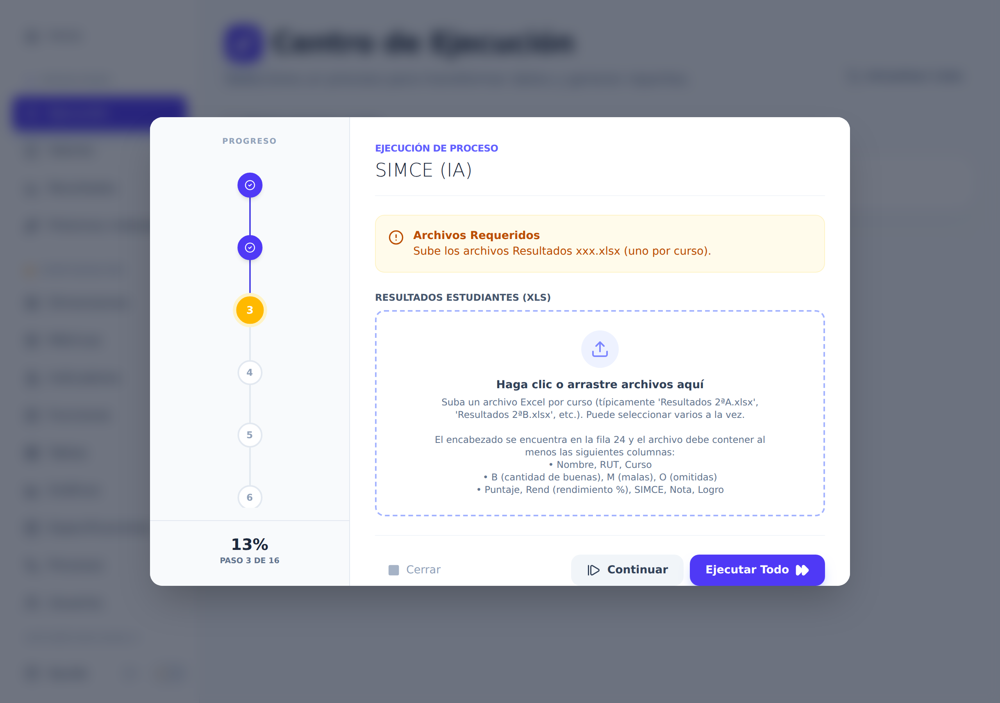
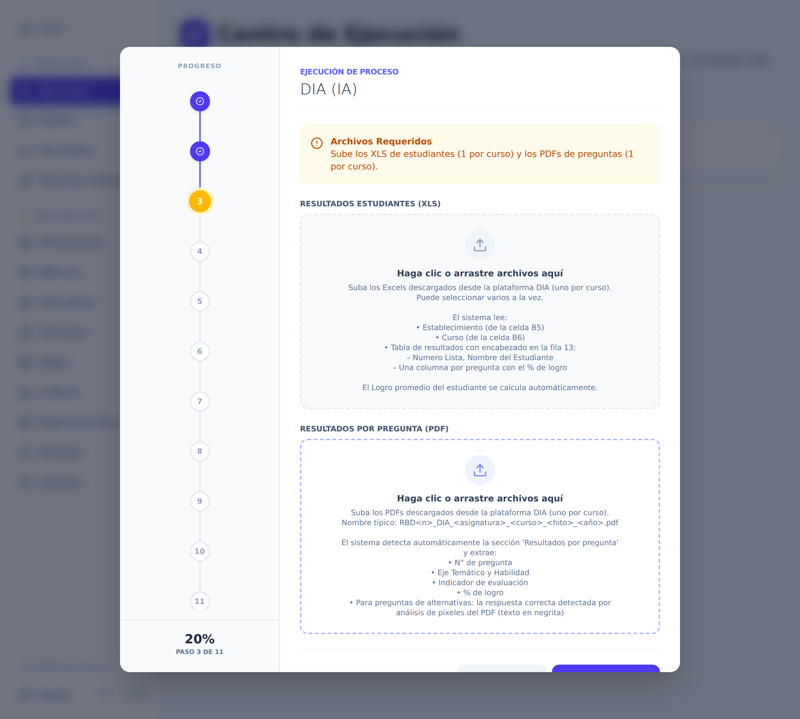
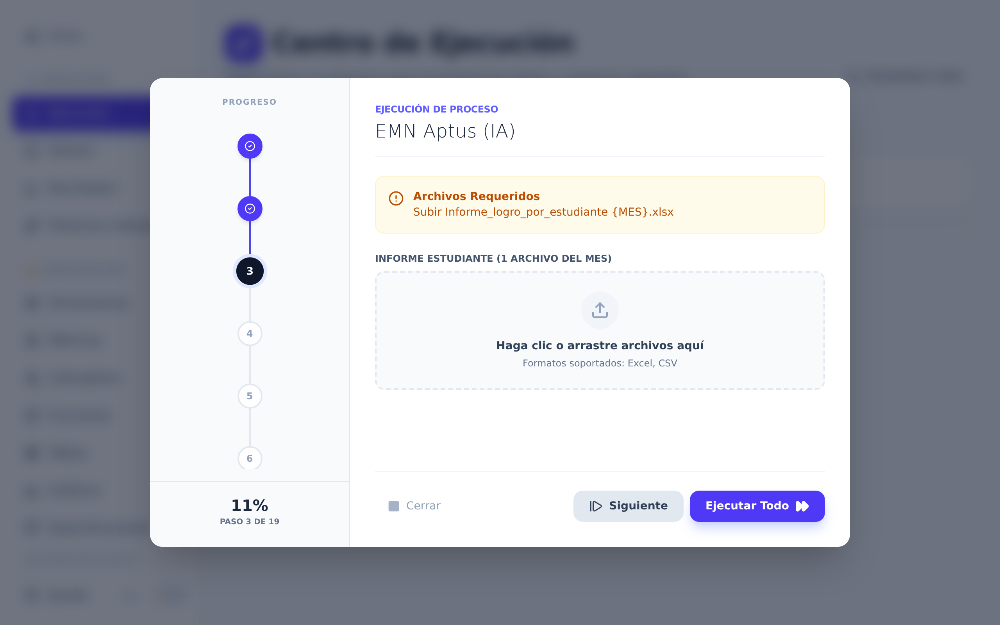

# Anexo — Carga de datos por evaluación

El flujo general de carga está en la [guía rápida](./guia_rapida_usuario.md#2-cargar-los-datos).
Acá va lo específico de cada evaluación: qué archivos pide, con qué nombre aparecen en
pantalla y qué no hay que tocarles. Busca el capítulo de la evaluación que vas a cargar y
sigue solo ese.

> **Evaluaciones que todavía no se cargan desde la plataforma.** IDEL, Cálculo Veloz y
> Fluidez Lectora sí tienen sus resultados y sus informes en el sistema, pero esos datos
> los cargó el equipo técnico directamente. Aún no existe un proceso de carga en la
> pantalla de Ejecución para ellas: van por el
> [camino 2.2 de la guía rápida](./guia_rapida_usuario.md#22-la-evaluación-no-tiene-proceso-configurado).

---

## 1. SIMCE

**Nombre del proceso en Ejecución:** `SIMCE (IA)`

Sirve para Lenguaje y para Matemáticas: la asignatura se elige al principio, así que
**una ejecución = una asignatura, de un mes, de una prueba**.

### Primero te pide unos datos

Antes de los archivos aparece el recuadro **Datos del Run**, que se responde una sola vez:

| Campo | Cómo responderlo |
|---|---|
| **Establecimiento** | Elige `Pullinque` o `Panguipulli` en la lista. |
| **Año** | El año de la evaluación (viene escrito `2026`). |
| **Asignatura** | `Lenguaje` o `Matemáticas`. |
| **Mes** | El mes en que se rindió la prueba, de la lista (`MARZO` a `DICIEMBRE`). |
| **N° de Prueba** | El número de ensayo dentro del año: `1` para el primero, `2` para el segundo, etc. |

Completa todo y aprieta **Confirmar Datos**.

### Después te pide los archivos

El proceso se detiene **tres veces**, una por cada tipo de archivo:

| Recuadro en pantalla | Qué archivo es | Formato | ¿Obligatorio? |
|---|---|---|---|
| **Resultados Estudiantes (XLS)** | Los `Resultados 2ªA.xlsx`, `Resultados 2ªB.xlsx`… que entrega la agencia, uno por curso. Puedes seleccionarlos todos juntos. | Excel | Sí |
| **Reporte por Pregunta (XLS)** | Los `ReportePregunta 2ªA.xlsx`, `ReportePregunta 2ªB.xlsx`… uno por curso. También van todos juntos. | Excel | Sí |
| **Habilidades por Pregunta (XLS)** | Un único Excel con la habilidad y el eje temático de cada pregunta de esa prueba. | Excel | Sí |

### Qué NO hacer con los archivos

- **No renombres los archivos `ReportePregunta …`**. El sistema saca el curso del nombre
  del archivo (el `2ªA`, `2ªB`…). Si lo cambias, las preguntas quedan sin curso.
- **No agregues ni borres filas arriba del encabezado** de `Resultados …`: la tabla
  empieza exactamente en la fila 24 y el sistema cuenta desde ahí.
- **No cambies los títulos de las columnas.** En `Resultados …` se usan tal cual
  `Nombre`, `RUT`, `Curso`, `B`, `M`, `O`, `Puntaje`, `Rend`. En `ReportePregunta …` se
  usan `Pregunta`, `Correcta` y `Distractor`, y el sistema ubica la tabla buscando el
  texto **`Forma 1`**: si lo borras o lo editas, no encuentra nada. En el archivo de
  habilidades, la primera fila tiene que decir exactamente `Pregunta`, `Habilidad` y
  `Eje Temático` (un archivo antiguo que llame `N°` a la primera columna ya no sirve).

### Si algo sale mal

- **Los resultados por pregunta salen sin número de pregunta.** Pasó en la carga de mayo
  2026: se perdía la columna `Pregunta` al cruzar con el archivo de habilidades. Ya está
  corregido y los datos se repararon, pero si lo vuelves a ver, avisa antes de cargar de
  nuevo.
- **Un curso aparece vacío o repetido.** Casi siempre es un `ReportePregunta` renombrado
  o subido dos veces. Revisa la lista de archivos antes de apretar **Continuar**.
- **Subiste la asignatura equivocada.** Los datos quedan guardados con la asignatura que
  elegiste al principio, no con la del archivo. Avisa al administrador: hay que borrar
  esas filas.

---

## 2. DIA

**Nombre del proceso en Ejecución:** `DIA (IA)`

Una ejecución cubre **un hito y una asignatura** completos (todos los cursos juntos).

### Primero te pide unos datos

| Campo | Cómo responderlo |
|---|---|
| **Hito** | El momento del año en que se aplicó: `DIAGNOSTICO`, `INTERMEDIO` o `FINAL`. Es el mismo que dice el nombre de los archivos que descargaste. |
| **Asignatura** | `LECTURA` o `MATEMATICA`. |

> ⚠️ Este proceso **no pregunta el año**: lo guarda fijo como 2026.
>
> ### ⚠️ COMPLETAR POR MIGUEL ###
> ### (qué debe hacer el usuario cuando cambie el año: ¿el administrador edita el proceso, se crea uno nuevo, o se agregará el campo "Año" al formulario?) ###

### Después te pide los archivos

Se detiene **una sola vez**, con dos recuadros en la misma pantalla:

| Recuadro en pantalla | Qué archivo es | Formato | ¿Obligatorio? |
|---|---|---|---|
| **Resultados Estudiantes (XLS)** | Los Excel de resultados por estudiante que descargas de la plataforma DIA, uno por curso (`resultados_estudiantes_…_diagnostico_2026.xls`). Van todos juntos. | Excel | Sí |
| **Resultados por Pregunta (PDF)** | Los informes en PDF de la plataforma DIA, uno por curso. El nombre típico es `RBD16844_DIA_LECTURA_I_A_diagnostico_2026.pdf`. | PDF | Sí |

### ⚠️ COMPLETAR POR MIGUEL ###
### (dónde exactamente se descargan estos dos archivos en la plataforma DIA: nombre del menú/reporte para el Excel de estudiantes y para el PDF por curso, para poder escribir el paso a paso) ###

### Qué NO hacer con los archivos

- **Súbelos tal como los descargaste, sin abrir y volver a guardar.** El sistema lee
  datos que están fuera de la tabla: el establecimiento está en la celda **B5** y el
  curso en la celda **B6**. Si esas celdas se mueven, el curso queda mal.
- **No toques el encabezado de la fila 13**, donde dicen `Número de Lista` y
  `Nombre del Estudiante`. Escribir `Numero de Lista` sin tilde, o cambiar
  `Nombre del Estudiante` por `Nombre`, deja columnas sin cruzar.
- **No mezcles hitos ni asignaturas en una misma ejecución**, ni renombres los PDF: todo
  queda guardado con el hito que elegiste al principio.

### Si algo sale mal

- **El nombre de un estudiante aparece en blanco o duplicado entre hitos.** La
  plataforma DIA a veces entrega el nombre como "Nombre Apellido" y a veces como
  "Apellido Nombre". El sistema ahora normaliza el nombre para poder seguir al mismo
  estudiante entre hitos; si aun así ves duplicados, avisa.
- **El paso de los PDF se demora.** Es normal: leer cada PDF toma varios segundos. No
  cierres la ventana mientras dice *Ejecutando proceso…*.
- **Una columna esperada llegó vacía.** Si un encabezado del Excel viene cambiado, la
  carga igual termina, pero el sistema deja registrado un aviso diciendo que esa columna
  quedó sin datos. No aparece en pantalla: si los resultados se ven raros, pídele al
  administrador que revise el registro de la ejecución.

---

## 3. SIMCE Panguipulli (ensayos Aptus)

**Nombre del proceso en Ejecución:** `EMN Aptus (IA)`

Son los ensayos SIMCE que aplica Aptus en Panguipulli. **Una ejecución = un mes.** Si
tienes que cargar abril y mayo, ejecutas el proceso dos veces.

### Te pide tres archivos, de a uno

Este proceso **no te pregunta ningún dato**: el mes, la asignatura y el curso los saca de
los propios archivos, y el establecimiento queda siempre como *Panguipulli*. Se detiene
tres veces seguidas y en cada pausa va **un solo archivo**, el del mes que estás cargando:

| Recuadro en pantalla | Qué archivo es | Formato | ¿Obligatorio? |
|---|---|---|---|
| **Informe Estudiante (1 archivo del mes)** | `Informe_logro_por_estudiante MAYO.xlsx` | Excel | Sí |
| **Informe OA (1 archivo del mes)** | `Informe_logro_por_OA MAYO.xlsx` | Excel | Sí |
| **Informe Habilidad (1 archivo del mes)** | `Informe_logro_por_habilidad MAYO.xlsx` | Excel | Sí |

### ⚠️ COMPLETAR POR MIGUEL ###
### (cómo se obtienen estos tres informes: ¿los descarga el colegio desde la plataforma Aptus, los envía Aptus por correo? Nombre del menú o del reporte, para escribir el paso a paso) ###

### Qué NO hacer con los archivos

- **No cambies los títulos de las columnas**, que vienen todos en mayúsculas:
  `NOMBRE PROCESO`, `AÑO`, `NIVEL`, `CURSO`, `ASIGNATURA`, `PORCENTAJE LOGRO`… El
  informe de OA además usa `NÚMERO OA` y `LOGRO`, y el de habilidad
  `PORCENTAJE LOGRO CURSO` y `PORCENTAJE LOGRO HABILIDAD`.
- **No edites la columna `NOMBRE PROCESO`.** De ahí sale el mes: el sistema lee
  `EMN Mayo` y guarda `MAYO`.
- **No pongas el archivo de un mes en la pausa de otro tipo de informe.** Los tres son
  del mismo mes, pero cada recuadro espera el suyo (estudiante, OA, habilidad).

### Si algo sale mal

- **El N° de prueba aparece como 0.** El sistema numera las pruebas por mes:
  abril = 1, mayo = 2, agosto = 3, septiembre = 4. Si el archivo trae otro mes, la prueba
  queda con número 0. Avisa al administrador para que agregue ese mes.
- **Los porcentajes salen extraños.** Estos archivos traen los decimales con coma
  (`0,444444`). El sistema los convierte solo; no los reemplaces a mano.
- **Cargaste dos veces el mismo mes.** Los datos se suman, no se reemplazan: quedarían
  duplicados. Revisa en **Valores** antes de volver a ejecutar.

---

Termines la carga que termines, revisa lo que quedó cargado siguiendo
[la guía rápida](./guia_rapida_usuario.md#revisa-lo-que-quedó-cargado).
