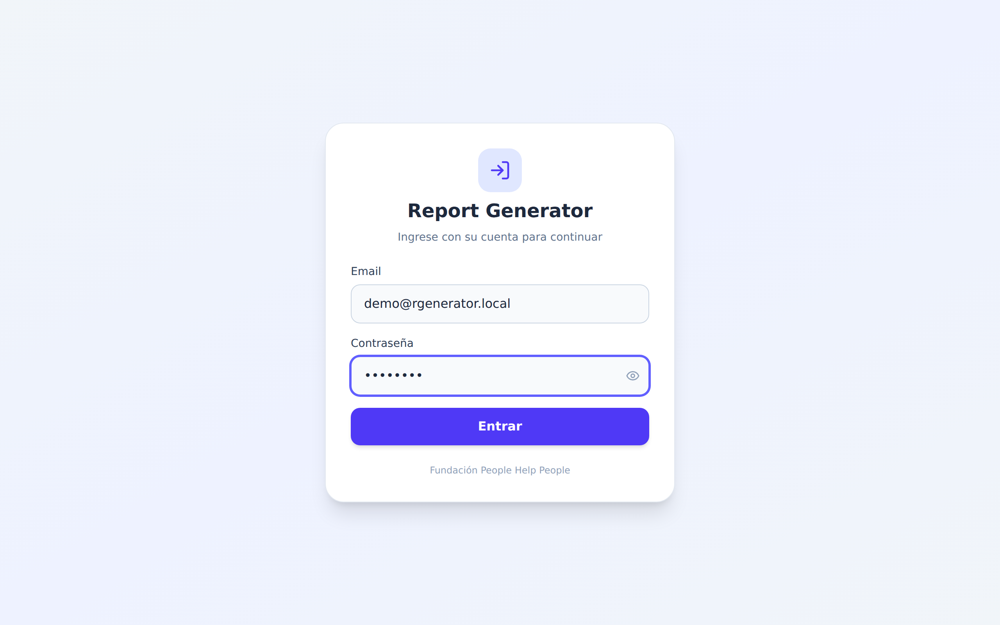
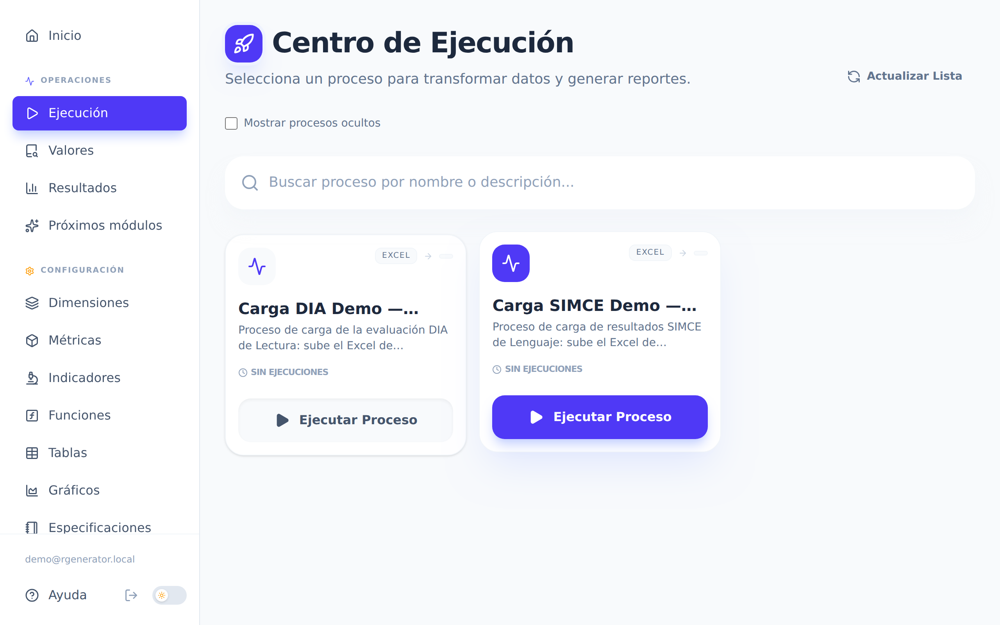
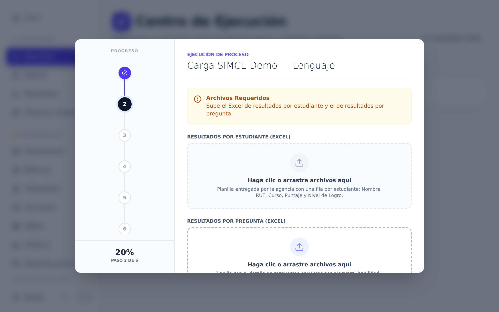
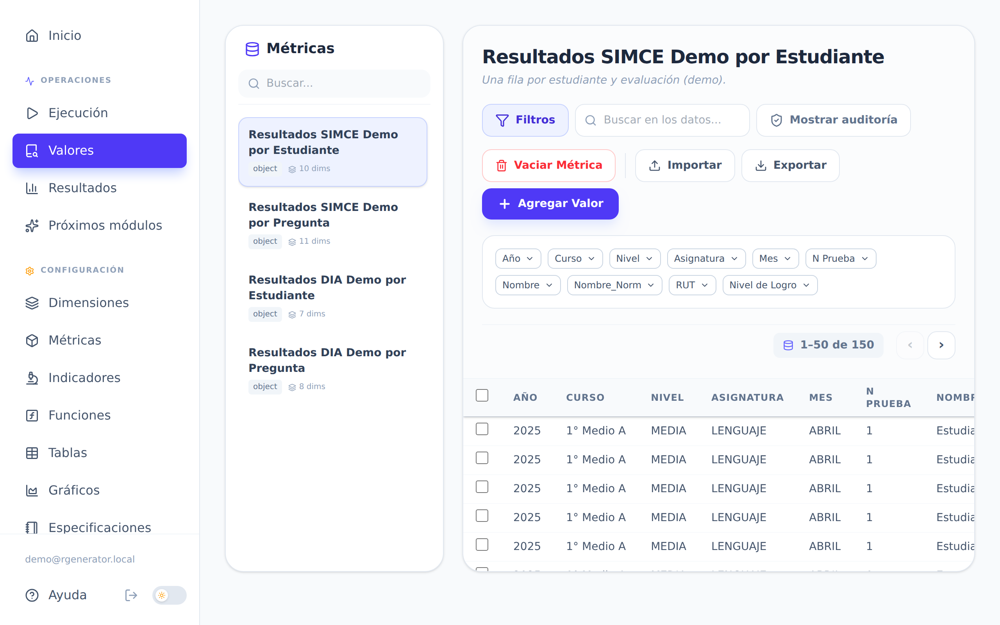
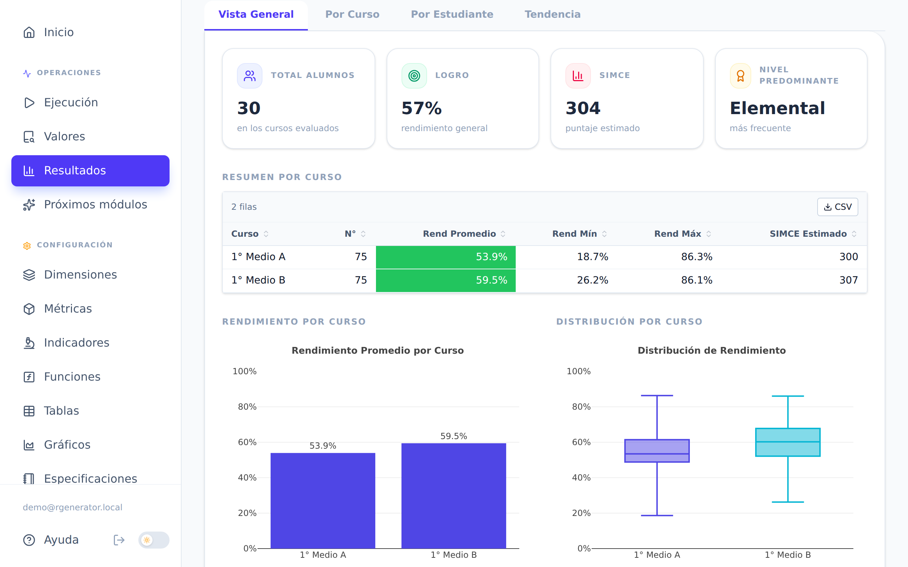
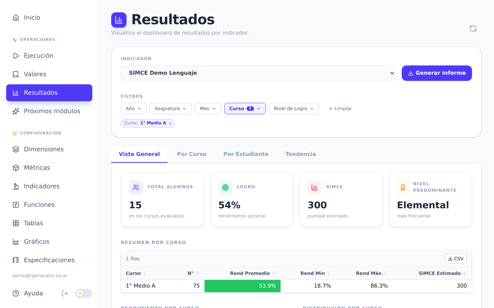
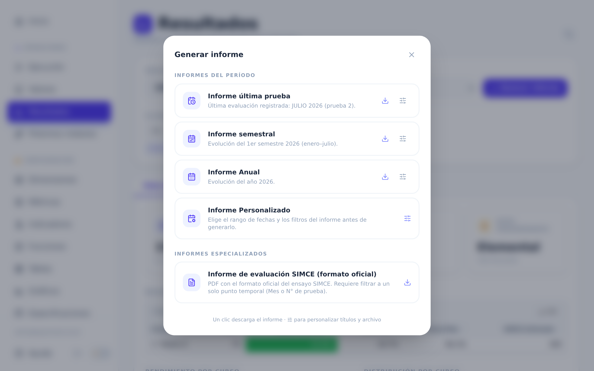
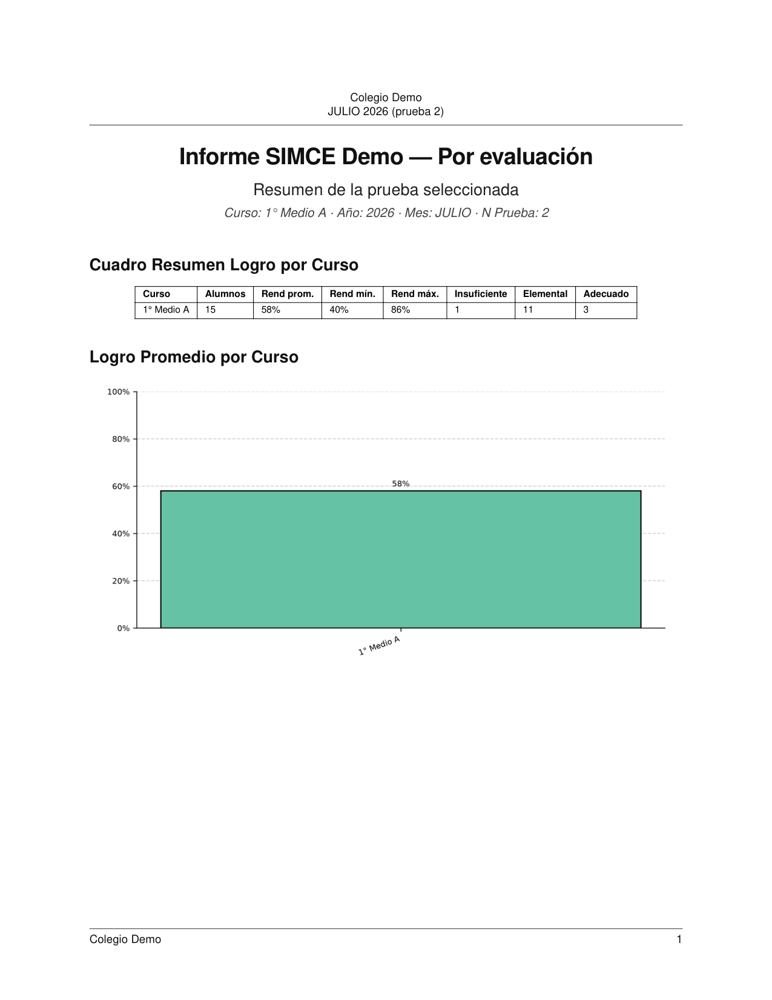

# Guía rápida — Report Generator

Cuatro pasos para cargar los resultados de una evaluación y descargar tu informe.

> Las imágenes de esta guía son de una **organización de demostración**, con datos
> inventados. En tu cuenta verás los nombres y cursos de tu propio colegio.

**Necesitas:** tu usuario y contraseña, y el archivo Excel de resultados tal como lo
entrega la agencia evaluadora.

---

## Paso 1 — Cargar tus datos

Ingresa a la plataforma con tu correo y contraseña.

En el menú de la izquierda entra a **Ejecución**. Ahí está el Centro de Ejecución,
con una tarjeta por cada proceso de carga ya configurado para tu colegio.

Busca la tarjeta de la evaluación que vas a cargar y haz clic en **Ejecutar Proceso**.

Se abre una ventana que avanza por pasos. Cuando llegue a un paso que necesita
tus archivos, se detiene y te muestra un recuadro por cada archivo pedido.

1. Arrastra el archivo al recuadro, o haz clic para buscarlo en tu computador.
2. Repite con cada recuadro. Los que dicen *opcional* puedes dejarlos vacíos.
3. Haz clic en **Siguiente** para continuar.
4. Si el proceso te pide un dato extra (por ejemplo, el hito de la evaluación),
   complétalo y confirma.

Cuando termine verás el mensaje **¡Proceso Completado!**. Ahí tus datos ya quedaron
guardados: cierra la ventana con **Finalizar**.

> 💡 Sube el archivo original de la agencia, sin cambiar el orden de las columnas
> ni agregar filas arriba del encabezado.

---

## Paso 2 — Revisar los datos en Valores

Antes de mirar los resultados, conviene confirmar que lo que subiste quedó bien.

Entra a **Valores** en el menú de la izquierda y elige la métrica que acabas de
cargar. A la derecha aparecen los datos, con el total de filas arriba de la tabla.

Para revisar una parte específica:

- Haz clic en **Filtros** para desplegar los filtros por columna (Año, Curso, Mes...).
  Abre el que necesites y marca los valores que quieres ver.
- Usa **Buscar en los datos...** para encontrar un nombre o un RUT concreto.

Revisa que el número de filas calce con lo que esperabas y que los cursos y meses
sean los correctos.

> 💡 ¿Ves datos repetidos o de una carga equivocada? Avisa al administrador antes
> de seguir: es más fácil corregirlo ahora que después.

---

## Paso 3 — Interpretar tu indicador

Entra a **Resultados** y elige tu indicador en la lista de arriba. El panel se
arma solo.

Lo que estás viendo:

- **Pestañas** (Vista General, Por Curso, Por Estudiante, Tendencia): cada una
  muestra un corte distinto de los mismos datos.
- **Tarjetas de resumen**: los números gruesos del total de alumnos, el
  rendimiento general y el nivel más frecuente.
- **Tablas y gráficos**: el detalle curso por curso.
- **Colores de los niveles de logro**: son siempre los mismos en todo el sistema.
  El rojo marca el nivel más bajo y el verde el más alto, así que puedes leer un
  gráfico de un vistazo sin revisar la leyenda.

Para mirar solo una parte, usa los **filtros** que están bajo el indicador. Al
elegir un valor aparece una etiqueta (un "chip") con lo que está aplicado, y
todos los gráficos se actualizan juntos.

Quita un filtro con la **×** de su chip, o sácalos todos con **Limpiar**.

> 💡 Si un gráfico se ve vacío, casi siempre es porque los filtros activos no
> dejan ningún dato. Quítalos de a uno hasta que reaparezca.

---

## Paso 4 — Descargar informes

Con tu indicador en pantalla, haz clic en **Generar informe**.

Elige la tarjeta que necesites. **Un clic descarga el PDF de inmediato:**

| Tarjeta | Qué trae |
|---|---|
| **Informe última prueba** | Solo la evaluación más reciente. |
| **Informe semestral** | La evolución del semestre en curso. |
| **Informe Anual** | La evolución del año. |
| **Informe Personalizado** | Tú eliges el rango de fechas y los filtros. |

Más abajo, en **Informes especializados**, están los informes con formato oficial de cada evaluación.

Así se ve el PDF que descargas:

### Personalizar antes de descargar

El botón de **deslizadores** (a la derecha de cada tarjeta) abre un panel para
ajustar los títulos del encabezado, el pie de página y el nombre del archivo.
Cambia lo que necesites y descarga desde ahí.

### Si una tarjeta está gris

Una tarjeta apagada no se puede descargar, y la razón está escrita en la misma
tarjeta. Las dos más comunes:

- **Sin datos cargados para este indicador** → vuelve al Paso 1.
- **Este informe aún no está configurado** → avísale al administrador.

> 💡 Los informes especializados a veces piden que primero filtres a una sola
> prueba (un Mes o un N° de prueba). El sistema te lo indica antes de generarlo.

---

¿Se te quedó algo en el camino? El [tutorial extendido](./tutorial_usuario.md) tiene el paso a paso completo y una tabla de problemas frecuentes.
