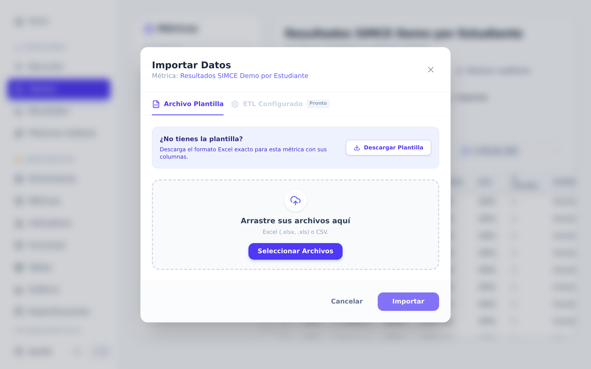

# Guía rápida — Report Generator

Entrar, cargar los datos de una evaluación, mirar los resultados y descargar el informe.

> Las imágenes de esta guía son de un **colegio de ejemplo**, con datos inventados. En tu
> cuenta vas a ver los nombres y cursos de tu propio colegio.

---

## 1. Entrar a la aplicación

Abre la dirección de la plataforma. Escribe tu correo y tu contraseña.

¿No tienes correo y contraseña? ¿La contraseña dejó de funcionar? Pídeselas al
administrador (la persona que maneja las cuentas de tu colegio).

---

## 2. Cargar los datos

Hay **dos caminos** y vas a usar solo uno. Para saber cuál te toca, entra a **Ejecución**
en el menú de la izquierda. Esa pantalla se llama **Centro de Ejecución** y muestra una
tarjeta por cada proceso ya configurado para tu colegio. Un proceso es una carga
automática que el equipo dejó lista: tú solo entregas los archivos. Si ves una tarjeta con
el nombre de tu evaluación, sigue el camino 2.1. Si no aparece ninguna, sigue el 2.2.

### 2.1 La evaluación tiene un proceso configurado (SIMCE, DIA)

Busca la tarjeta de tu evaluación y haz clic en **Ejecutar Proceso**.

Se abre una ventana que avanza sola, paso a paso. Cuando necesite tus archivos se detiene
y te muestra un recuadro por cada archivo que pide.

1. Arrastra el archivo hasta el recuadro, o haz clic en el recuadro y búscalo en tu
   computador.
2. Haz lo mismo con cada recuadro. Los que dicen *opcional* puedes dejarlos vacíos.
3. Haz clic en **Siguiente** y el proceso sigue avanzando.
4. A veces el proceso te pide además un dato escrito, por ejemplo el mes de la prueba.
   Complétalo y confirma.

Cuando termine vas a ver el mensaje **¡Proceso Completado!**: tus datos ya quedaron
guardados. Cierra la ventana con **Finalizar**.

¿Qué archivo va en cada recuadro? ¿Qué no hay que modificarle? Está todo en el
[anexo de carga por evaluación](./anexo_carga_pipelines.md).

### 2.2 La evaluación no tiene proceso configurado

Los datos se suben a mano, desde una planilla Excel:

1. Entra a **Valores** en el menú de la izquierda y elige la métrica que vas a llenar (una
   métrica es un conjunto de datos, por ejemplo los puntajes de SIMCE Lenguaje).
2. Haz clic en **Importar**, arriba a la derecha de la tabla.
3. ¿Todavía no tienes la planilla? Haz clic en **Descargar Plantilla**. Se baja un Excel
   con las columnas exactas de esa métrica, listo para rellenar.
4. Rellena la planilla.
5. Arrástrala al recuadro, o búscala con **Seleccionar Archivos**, y haz clic en
   **Importar**.

> 💡 No cambies ni muevas los títulos de las columnas de la plantilla. El sistema los usa
> para saber qué es cada dato.

### Revisa lo que quedó cargado

Con cualquiera de los dos caminos, revisa lo que quedó guardado. Entra a **Valores** y
elige tu métrica. Mira el total de filas, que aparece arriba de la tabla, y confirma que
los cursos y los meses sean los que esperabas. El botón **Filtros** te deja
mostrar solo una parte de la tabla, por ejemplo un curso. En **Buscar en los datos...**
escribes un nombre o un RUT para encontrarlo. Si ves datos repetidos, o datos de una carga
equivocada, avisa al administrador antes de seguir: es más fácil corregirlo ahora que
después.

---

## 3. Interpretar los resultados en el Dashboard

Entra a **Resultados** y elige tu indicador en la lista de arriba. Un indicador es aquello
que la evaluación mide, por ejemplo la comprensión lectora. Los gráficos se arman solos:
esa pantalla llena de gráficos es el dashboard.

- **Pestañas** (Vista General, Por Curso, Por Estudiante, Tendencia): cada una muestra los
  mismos datos, pero mirados de otra forma.
- **Tarjetas de resumen**: los números grandes de arriba. Traen el total de alumnos, el
  rendimiento general y el nivel que más se repite.
- **Tablas y gráficos**: el detalle curso por curso.
- **Colores de los niveles de logro**: son siempre los mismos en todo el sistema, rojo el
  nivel más bajo y verde el más alto. Así lees un gráfico sin revisar la leyenda.

Para mirar solo una parte de los datos, usa los **filtros** que están debajo del indicador.
Al elegir un valor aparece una etiqueta con el filtro que quedó puesto, y todos los
gráficos se actualizan al mismo tiempo. Para sacar un filtro, haz clic en la **×** de su
etiqueta. Para sacarlos todos de una vez, usa **Limpiar**.

> 💡 ¿Un gráfico se ve vacío? Casi siempre es porque los filtros puestos no dejan pasar
> ningún dato. Sácalos de a uno hasta que el gráfico vuelva a aparecer.

---

## 4. Exportar el informe

Con tu indicador en pantalla, haz clic en **Generar informe**. Se abre una ventana con una
tarjeta por cada tipo de informe. Haz clic en la que necesites y el PDF se descarga.

| Tarjeta | Qué trae |
|---|---|
| **Informe última prueba** | Solo la evaluación más reciente. |
| **Informe semestral** | Cómo cambiaron los resultados durante el semestre. |
| **Informe Anual** | Cómo cambiaron los resultados durante el año. |
| **Informe Personalizado** | Tú eliges desde qué fecha hasta qué fecha, y qué filtros usar. |

Más abajo, en **Informes especializados**, están los informes con el formato oficial de
cada evaluación. A la derecha de cada tarjeta hay un botón con forma de controles
deslizantes. Ese botón abre un panel para cambiar, antes de descargar, el texto de arriba
del PDF, el de abajo y el nombre del archivo.

Las tarjetas grises no se pueden descargar y la razón está escrita en la misma tarjeta. Si
dice *Sin datos cargados para este indicador*, vuelve a la sección 2. Si dice *Este
informe aún no está configurado*, avísale al administrador. Así se ve el PDF que descargas:

> 💡 Algunos informes especializados necesitan que primero dejes una sola prueba a la
> vista, filtrando por Mes o por N° de prueba. El sistema te lo avisa antes de generarlo.

---

## Anexo — Archivos necesarios por evaluación

Lo que tienes que tener a mano antes de empezar la carga. El detalle de cada archivo está
en el anexo enlazado: cómo se llama el recuadro en pantalla, en qué formato va y qué no
hay que modificarle.

- **SIMCE Pullinque**: Resultados por alumno · Resultados por pregunta · Habilidad y Eje
  Temático — [ver detalle](./anexo_carga_pipelines.md#1-simce)
- **DIA**: PDF de resultados · Excel con resultados por alumno —
  [ver detalle](./anexo_carga_pipelines.md#2-dia)
- **SIMCE Panguipulli**: *Pendiente: cómo se obtiene el archivo de Aptus* —
  [ver detalle](./anexo_carga_pipelines.md#3-simce-panguipulli-ensayos-aptus)

Las evaluaciones que no aparecen en esta lista se cargan por el camino 2.2.

---

¿Se te quedó algo en el camino? El [tutorial extendido](./tutorial_usuario.md) tiene el
paso a paso completo y una tabla con los problemas más frecuentes.
